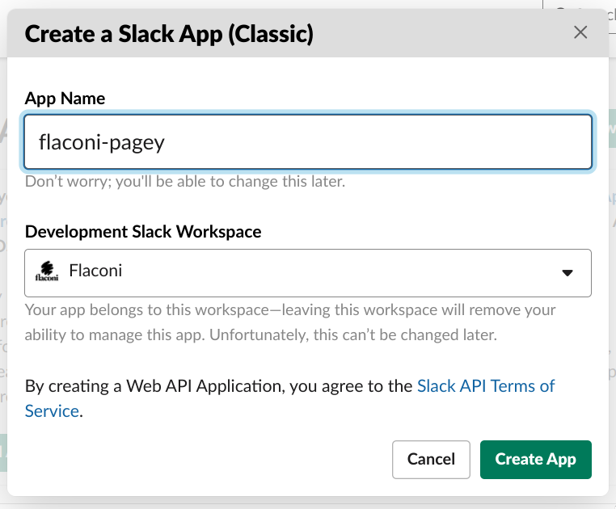
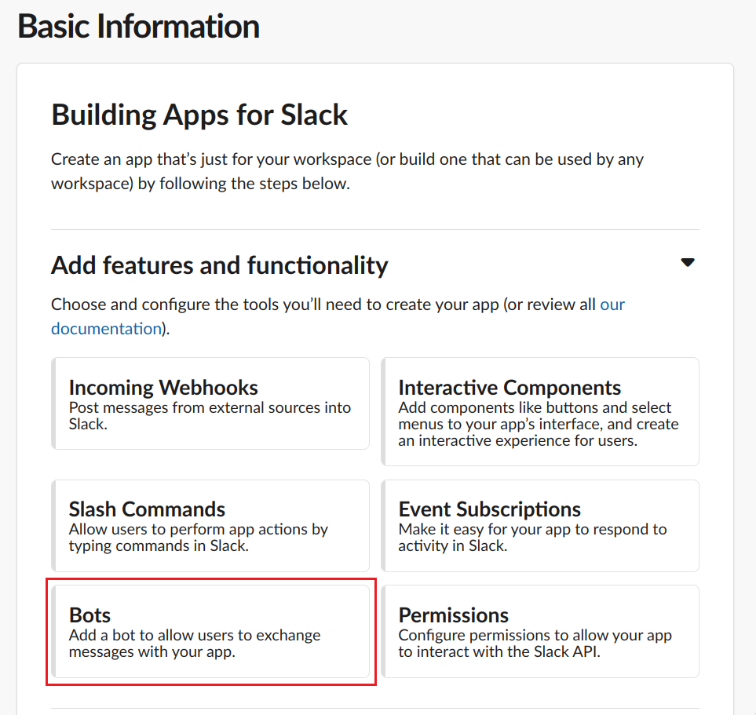
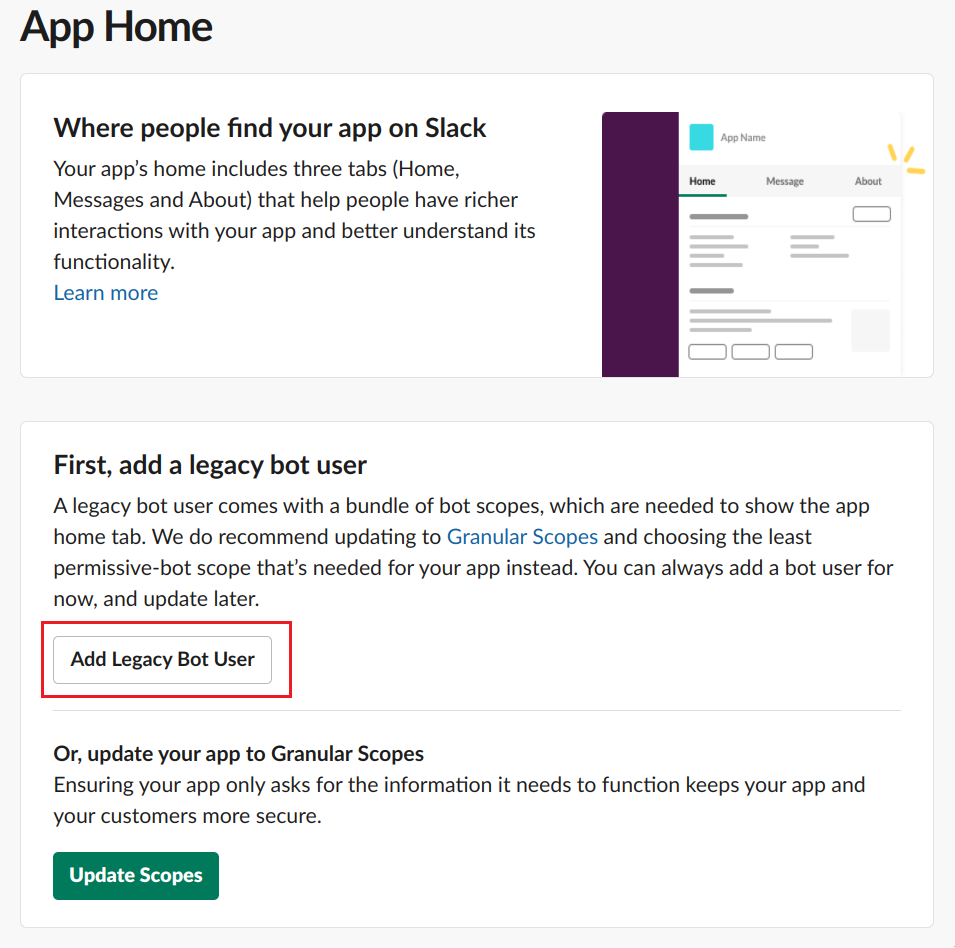
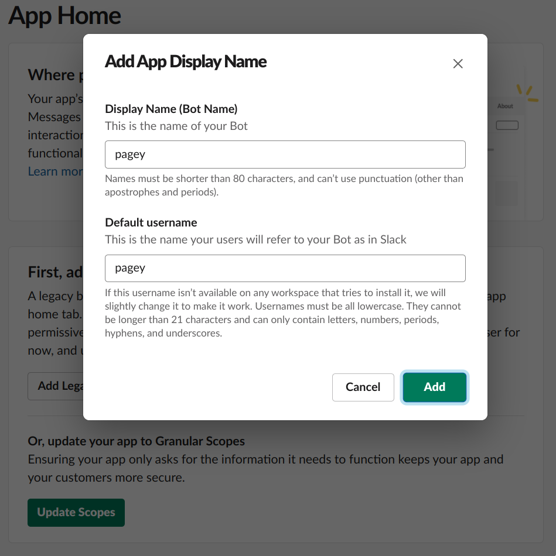
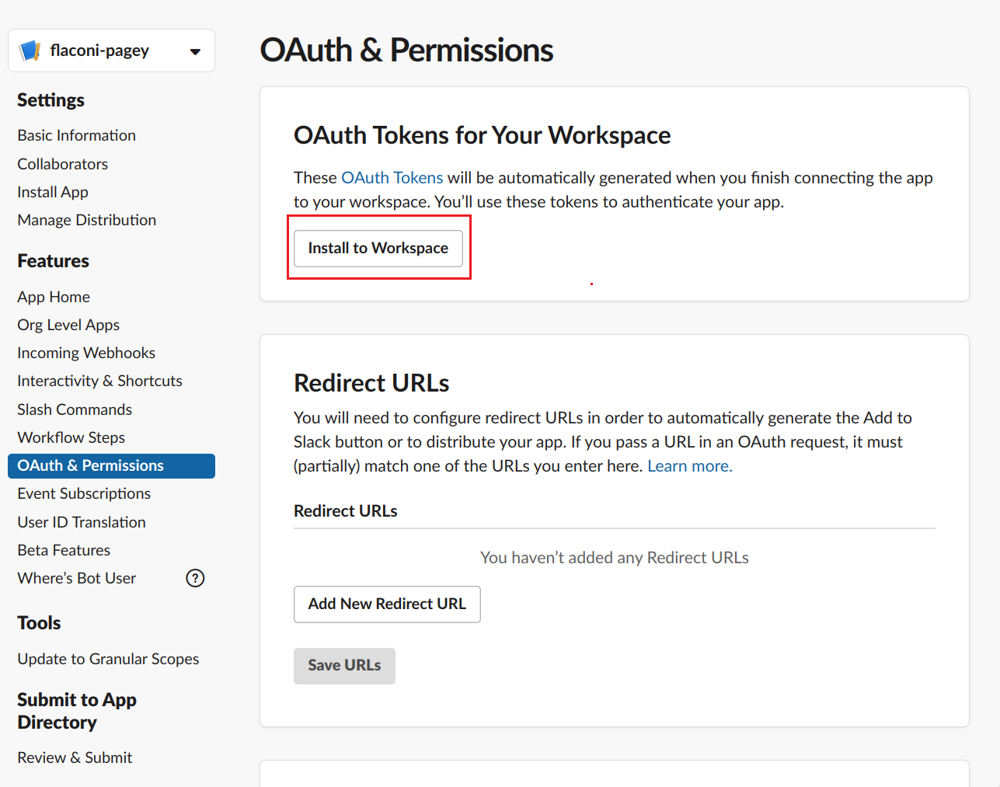
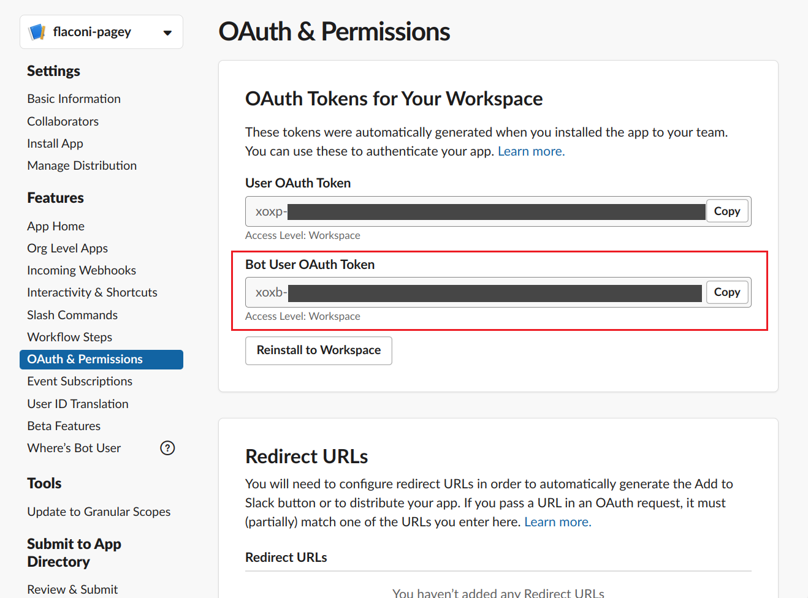

# Pagey documentation

## Create Slack app

| Image       | Description |
|-------------|-------------|
|  | Create a legacy Slack app here: https://api.slack.com/apps?new_classic_app=1 |
|  | Select bot feature |
|  | Add legacy bot user |
|  | Select display and username |
|  | Create OAUTH token by installing to workspace |
|  | Copy Bot User OAUTH Token |
